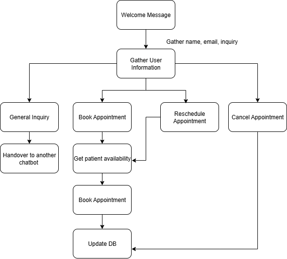

# Technical Write Up 

## Architecture 

### Key Components
* Supabase Edge Function
    - Contains webhooks 
        - BOOKING_CREATED 
            - Updates booking table with metadata in real time 
        - BOOKING_RESCHEDULED 
            - Updates relevant row with rescheduled time 
        - BOOKING_CANCELLED 
            - Updates relevant row status with cancellation 
* Tools 
    - Book Flu shot 
    - Book Consultation  

### Accomplished 
* Hassle free booking 
    - Agent can find free times and book slot that works for you 
* Real time table update for booked appointments using webhooks

### If I had more time 
I would ideally create a state graph or flow that maps out user intent. 

### Demo
https://www.loom.com/share/5c561ba9aa62442f8f7833e490f9876c?sid=e0774702-e868-475c-b221-308f73bd4407